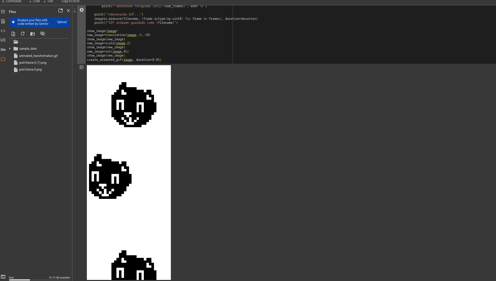
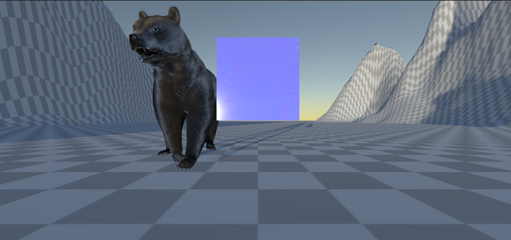
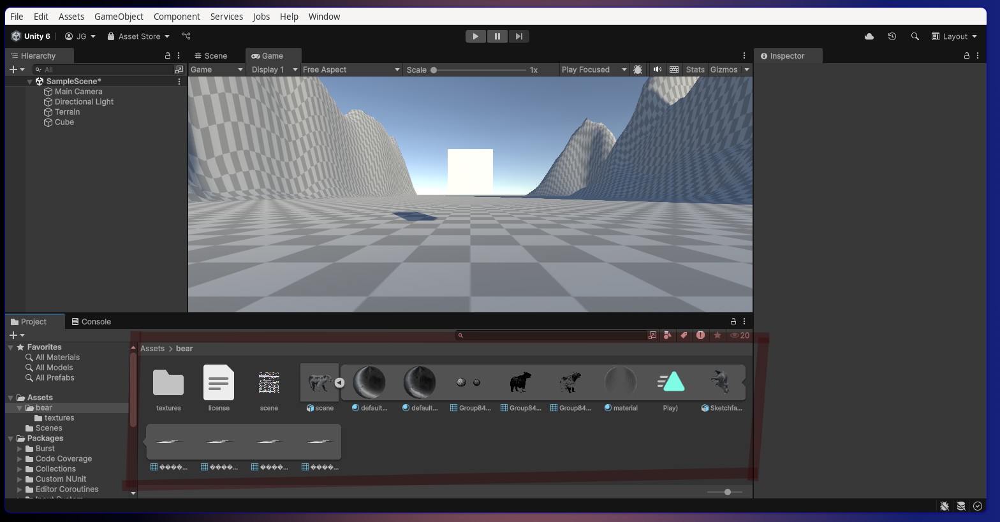
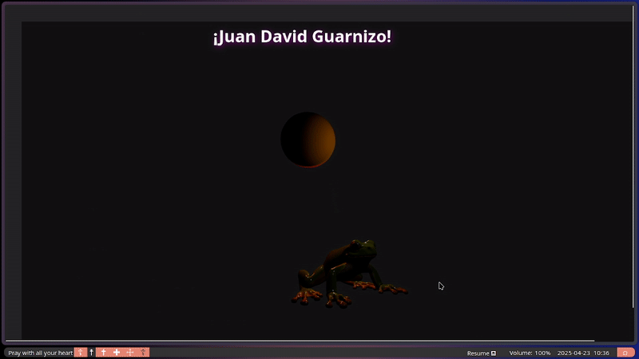
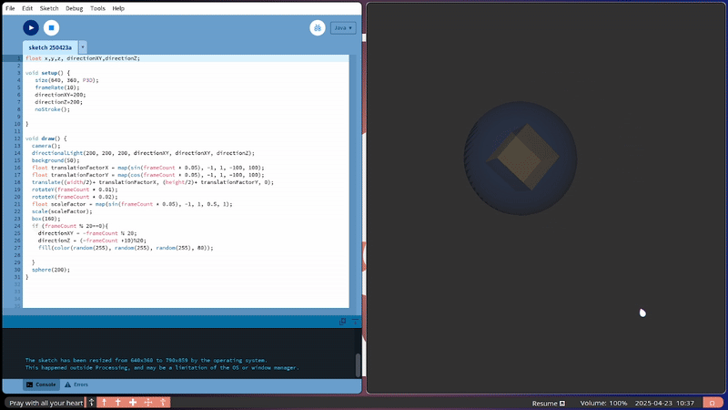
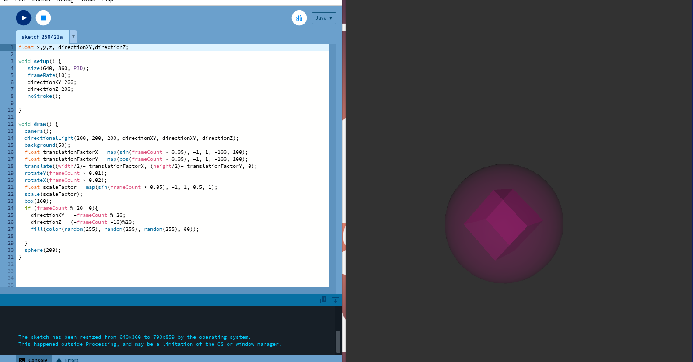

**Juan David Guarnizo**

## 📝 Description

This project was made to understand the basics of different technologies and good practices of coding and repos using tools like: Python (Matplotlib y NumPy), Unity (C#), Three.js, React and processing.

## 🛠️ Implementations

 |
For the python implementation, we focused on making the functions easy to understand and to work on any image, the user uploads its file and then we process the image in different stages, the user can use if he wants to only use some functions available on the repo or create a gif.

    |
For the unity project we put a bear and a box, we apply a series of transformations to the square on the scene and the bear stays still

 |
For the react app you can run it with npx vite after installing the packages, for this app we downloaded a model of a frog and we put some lights in the scene, on the top of the frog there is a floating sphere that makes the transformations

 **Processing** |  |

For the processing part we made two figures a cube and a sphere, the sphere it's inside the cube and we make everything different on every few frames changing the colors and the ilumination while we make the transformations 

