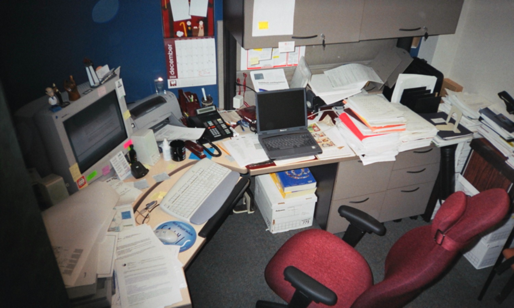
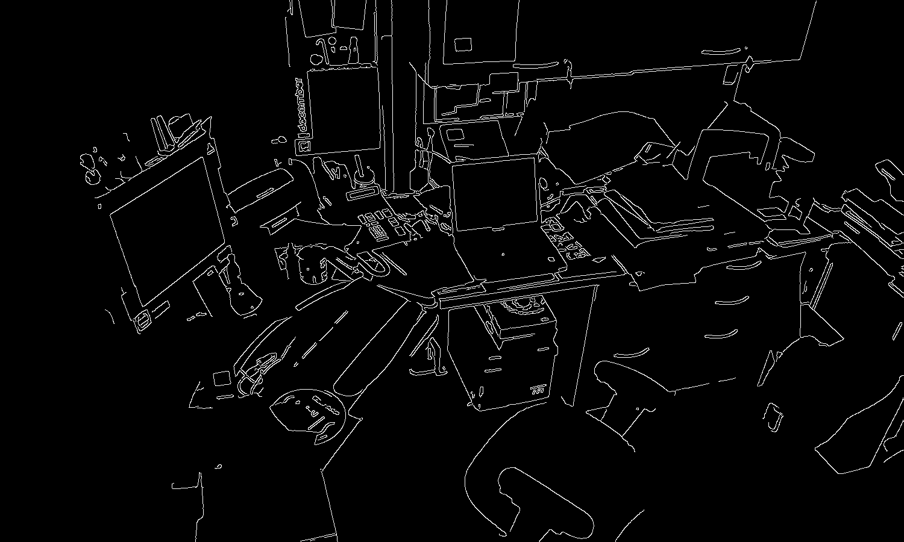
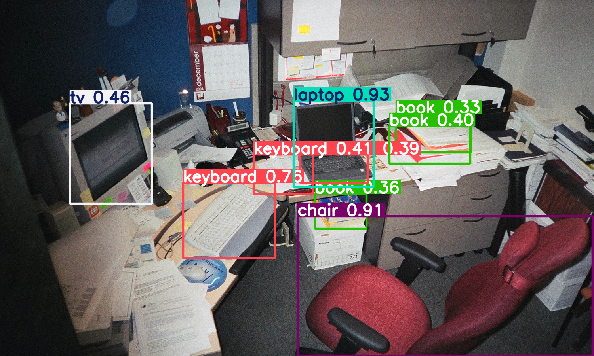

# Ejercicio 1: Procesamiento de Imagen y Detección con YOLO

Este repositorio contiene la solución para el Ejercicio 1 del taller, que involucra el procesamiento de imágenes con OpenCV y la detección de objetos utilizando modelos preentrenados de YOLO. El código está diseñado para ejecutarse en un entorno de Google Colab, permitiendo una fácil configuración y ejecución.

## Estructura del Proyecto 
ejercicio_1_procesamiento/
├── ejercicio_1_procesamiento.ipynb  # Cuaderno de Google Colab con todo el código
└── resultados/
  ├── suavizado.png                # Imagen después de aplicar el filtro de suavizado
  ├── bordes.png                   # Imagen con los bordes detectados
  └── deteccion_yolo.png           # Imagen con los bounding boxes y etiquetas de YOLO


## Requisitos

Para ejecutar este proyecto, solo necesitas una cuenta de Google para acceder a Google Colab. El cuaderno se encargará de instalar todas las dependencias necesarias.

## Cómo Ejecutar el Cuaderno en Google Colab

1.  **Abre el cuaderno:**
    * Crea un nuevo cuaderno en Google Colab y copia este código en sus respectivas celdas.

2.  **Sube tu imagen:**
    * Ejecuta la primera celda que te pedirá subir la imagen.

3.  **Ejecuta las celdas:**
    * Ejecuta cada celda del cuaderno secuencialmente. El cuaderno realizará los siguientes pasos:
        * Instalar las bibliotecas necesarias (OpenCV, Matplotlib, NumPy, Ultralytics YOLO).
        * Cargar la imagen que subiste.
        * Aplicar un filtro de suavizado Gaussiano.
        * Aplicar un filtro de detección de bordes Canny.
        * Visualizar la imagen original, la imagen suavizada y los bordes detectados.
        * Realizar la detección de objetos utilizando un modelo preentrenado de YOLOv8.
        * Mostrar y guardar la imagen con los bounding boxes y etiquetas de YOLO.

## Resultados

Los resultados del procesamiento de la imagen se guardarán automáticamente en la carpeta `resultados/` dentro de tu entorno de Colab. Una vez que el cuaderno termine de ejecutarse, podrás descargar esta carpeta para obtener las imágenes generadas:





Este ejercicio demuestra un flujo de trabajo fundamental en visión por computadora, donde el preprocesamiento de imágenes es tan crucial como la aplicación de modelos de Deep Learning para la detección de objetos.

Observaciones Clave:

Importancia del Preprocesamiento:

La aplicación de un filtro de suavizado (Gaussiano) antes de la detección de bordes es vital. Reduce el ruido de la imagen, lo que evita que el detector de bordes (Canny) interprete el ruido como bordes reales, resultando en contornos más limpios y precisos.

Python

# Suavizado Gaussiano: reduce ruido, mejora detección de bordes
img_suavizada = cv2.GaussianBlur(img_original, (5, 5), 0)
La detección de bordes (Canny) nos permite entender la estructura y las formas en la imagen. Los umbrales (threshold1, threshold2) son críticos para controlar la sensibilidad y la cantidad de bordes detectados. Un ajuste fino puede resaltar características importantes o eliminar ruido.

Python

# Detección de Bordes Canny: resaltar estructuras
img_bordes = cv2.Canny(img_suavizada, 100, 200) # Ajustar umbrales según la imagen
Eficiencia de YOLOv8:

YOLOv8 (ultralytics) se destaca por su facilidad de uso y alta eficiencia. Con solo unas pocas líneas de código, pudimos cargar un modelo preentrenado y realizar la inferencia.
```
Python

from ultralytics import YOLO
model = YOLO('yolov8n.pt') # 'n' para nano (rápido y ligero), 's' para small, 'm' para medium.
results = model(image_path) # Inferencias en la imagen
```
La función .plot() de los resultados de YOLO es extremadamente útil para la visualización rápida, ya que dibuja automáticamente los bounding boxes y las etiquetas sobre la imagen.
```
Python

for r in results:
    im_bgr = r.plot() # Genera una imagen OpenCV (BGR) con las detecciones
    cv2.imwrite('resultados/deteccion_yolo.png', im_bgr)
```
