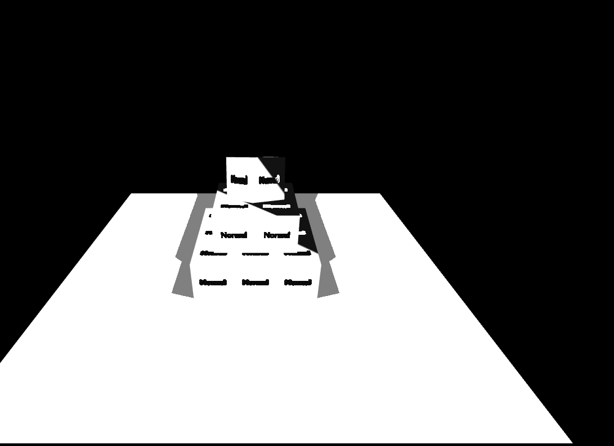

# Ejercicio 2
Una escena 3D interactiva construida con Three.js que renderiza una pirámide de cubos utilizando un flujo de trabajo de renderizado basado en la física (PBR) y una iluminación dinámica.
 

 Link:
 https://codesandbox.io/p/devbox/heuristic-currying-g8jsdy?workspaceId=ws_FnmiaiS1pBq9ebjJozR37e

# 🚀 Concepto del Proyecto
Este proyecto es una demostración de las capacidades fundamentales de Three.js para crear mundos 3D en el navegador. La escena presenta una pirámide construida de forma procedural a partir de cubos individuales, iluminada por una fuente de luz que proyecta sombras realistas sobre una base. El usuario puede explorar la escena libremente gracias a los controles de cámara orbitales.

El objetivo es servir como un ejemplo práctico y bien estructurado de los siguientes conceptos:

Configuración básica de una escena en Three.js.

Generación de geometría de forma procedural.

Aplicación de materiales PBR (Physically Based Rendering) con texturas.

Implementación de iluminación y sombras dinámicas.

Animación de objetos específicos y manejo del loop de renderizado.

#  Características Principales
Generación Procedural: La pirámide no es un modelo 3D importado, sino que se construye en tiempo de ejecución a partir de una estructura de datos (un array) que define la posición de cada cubo.

Materiales PBR: Se utiliza MeshStandardMaterial, el material estándar de renderizado basado en la física de Three.js. Se cargan texturas de Albedo, Normal, Roughness y Ambient Occlusion (actualmente como placeholders) para simular cómo la luz interactúa con las superficies de manera realista.

Iluminación y Sombras Dinámicas: La escena combina una AmbientLight para la iluminación general y una PointLight que actúa como una bombilla, proyectando sombras suaves y dinámicas (PCFSoftShadowMap) desde la pirámide hacia la base.

Controles de Cámara Orbitales: Gracias a OrbitControls, el usuario puede rotar, hacer zoom y arrastrar la cámara para observar la escena desde cualquier ángulo. La opción enableDamping suaviza el movimiento para una experiencia más fluida.

Animación Independiente: El cubo superior de la pirámide tiene su propia animación de rotación, demostrando cómo se pueden animar objetos individuales dentro del bucle de renderizado principal.

Diseño Responsivo: La escena y la cámara se ajustan automáticamente al tamaño de la ventana del navegador, manteniendo la proporción y la calidad visual en cualquier pantalla.

# Insights Técnicos y Aprendizajes
Este código es un excelente punto de partida para entender prácticas clave en el desarrollo con Three.js.

1. El Bucle Fundamental de Three.js
Todo proyecto en Three.js se basa en tres componentes esenciales que trabajan juntos en un bucle:

Scene: El contenedor que alberga todos los objetos, luces y cámaras.

Camera: El punto de vista desde el cual se observa la escena.

Renderer: El motor que dibuja la vista de la cámara en el elemento <canvas> del HTML.

El bucle de animación, gestionado por window.requestAnimationFrame(tick), es el corazón del proyecto: actualiza los controles, anima los objetos y vuelve a renderizar la escena en cada fotograma de la forma más eficiente posible.

2. Materiales Basados en la Física (PBR)
El uso de MeshStandardMaterial es un salto cualitativo respecto a materiales más simples como MeshBasicMaterial. El PBR intenta simular el comportamiento de la luz en el mundo real, y para ello se basa en propiedades como:

map (Albedo/Color): El color base del material.

roughnessMap (Rugosidad): Define qué tan pulida o rugosa es una superficie, afectando la nitidez de los reflejos.

normalMap: Añade detalle de superficie (abolladuras, relieves) sin aumentar la complejidad de la geometría.

aoMap (Ambient Occlusion): Pre-calcula sombras en las cavidades del modelo para añadir profundidad y realismo.

3. La Importancia de las Sombras
Las sombras son cruciales para dar profundidad y credibilidad a una escena 3D. El proceso (conocido como shadow mapping) implica:

Habilitar sombras en el renderer (renderer.shadowMap.enabled = true).

Definir qué objetos proyectan sombras (mesh.castShadow = true). Esto se hace para los cubos de la pirámide.

Definir qué objetos reciben sombras (mesh.receiveShadow = true). Esto se hace para el plano base.

Configurar la luz para que emita sombras (light.castShadow = true).

La calidad de las sombras se puede ajustar con light.shadow.mapSize para una mayor resolución.

4. Estructura de Módulos (ES6)
El uso de import ... from 'three' es la forma moderna de trabajar con JavaScript. Permite mantener el código organizado y solo cargar lo que se necesita. Para que esto funcione en el navegador, es indispensable que la etiqueta <script> en el index.html incluya el atributo type="module".
