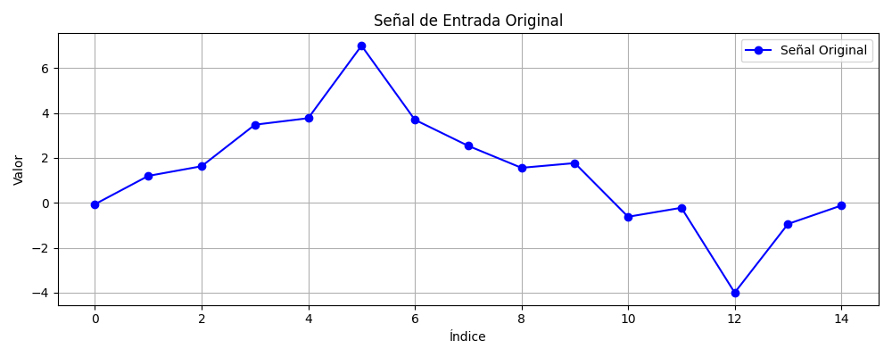
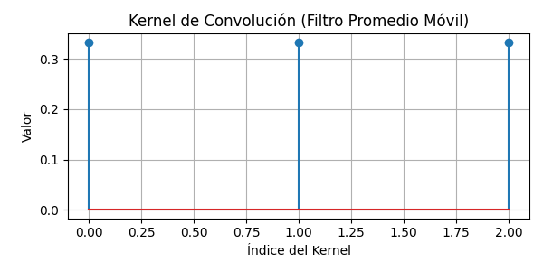
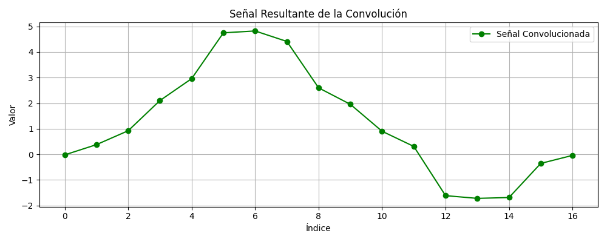
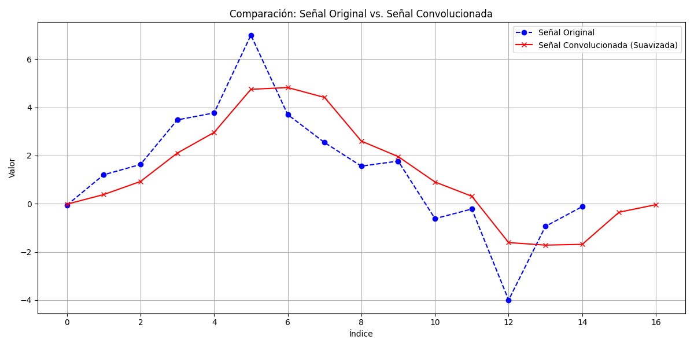

# Ejercicio 3: Convolución Unidimensional en Python

Este repositorio contiene la implementación desde cero de una función de convolución unidimensional (1D) en Python. El objetivo principal es comprender los fundamentos de esta operación crucial en el procesamiento de señales, sin depender de librerías de alto nivel como `numpy.convolve`. El proyecto se desarrolla en un cuaderno de Google Colab para facilitar su ejecución y visualización interactiva.

## Contenido y Estructura del Proyecto

El proyecto sigue una estructura modular y organizada para facilitar su comprensión y ejecución:
¡Mi error! Disculpa la confusión. Aquí tienes el README.md mejorado y detallado para el Ejercicio 3: Convolución Unidimensional, incluyendo los snippets de código, insights y las referencias a las imágenes en la carpeta graficos/.

Markdown

# Ejercicio 3: Convolución Unidimensional en Python

Este repositorio contiene la implementación desde cero de una función de convolución unidimensional (1D) en Python. El objetivo principal es comprender los fundamentos de esta operación crucial en el procesamiento de señales, sin depender de librerías de alto nivel como `numpy.convolve`. El proyecto se desarrolla en un cuaderno de Google Colab para facilitar su ejecución y visualización interactiva.

## Contenido y Estructura del Proyecto

El proyecto sigue una estructura modular y organizada para facilitar su comprensión y ejecución:

ejercicio_3_convolucion_1d/
├── ejercicio_3_convolucion_1d.ipynb  # Cuaderno de Google Colab con el código fuente y las visualizaciones.
└── graficos/
├── señal_original.png            # Gráfico de la señal de entrada definida, incluyendo posibles ruidos/picos.
├── kernel.png                    # Gráfico del kernel utilizado para la convolución (ej. un filtro de suavizado).
├── resultado.png                 # Gráfico de la señal resultante después de la convolución.
└── comparacion_suavizado.png     # Gráfico que superpone la señal original y la convolucionada para una comparación directa.

 ## Requisitos

Para ejecutar este cuaderno, solo necesitas:
* Una cuenta de Google (para acceder a Google Colab).
* Acceso a internet (para la instalación de librerías como `matplotlib`).

El cuaderno está diseñado para ser auto-contenido; instalará automáticamente las dependencias necesarias.

## Implementación de la Convolución 1D

La convolución unidimensional es una operación matemática que combina dos funciones (una señal y un kernel) para producir una tercera función que expresa cómo la forma de una se modifica por la otra. En procesamiento de señales, se utiliza comúnmente para aplicar filtros, como el suavizado o la detección de cambios.

La función `convolve_1d(signal, kernel)` implementa el cálculo de la convolución desde cero, sin usar funciones predefinidas de NumPy.

### Principios de la Implementación:

* **Longitud de la Salida:** Para una convolución "full", la longitud de la señal de salida es `(longitud_señal + longitud_kernel - 1)`. Esto asegura que todos los posibles solapamientos entre la señal y el kernel sean considerados.
* **Iteración:** El algoritmo itera sobre cada posible posición en la señal de salida.
* **Producto Suma (Dot Product):** Para cada posición de la salida, se realiza una suma ponderada de los elementos de la señal que se solapan con los elementos del kernel. Conceptualmente, el kernel se "desliza" sobre la señal, y en cada paso, se calcula la suma de los productos.

### El Código de la Función `convolve_1d`

```python
def convolve_1d(signal, kernel):
    signal_len = len(signal)
    kernel_len = len(kernel)
    output_len = signal_len + kernel_len - 1
    output = [0.0] * output_len # Inicializar la salida con ceros (usar float para precision)

    for i in range(output_len):
        current_output_value = 0.0
        for j in range(kernel_len):
            # signal_idx = i - (kernel_len - 1 - j)  # Para convolución con kernel invertido
            # La implementación común en ML usa esta relación, que es técnicamente correlación cruzada
            signal_idx = i - j 

            if 0 <= signal_idx < signal_len:
                current_output_value += signal[signal_idx] * kernel[j]
        output[i] = current_output_value
    return output
```
Resultados Visuales
Una vez ejecutado el cuaderno, la carpeta graficos/ contendrá las siguientes visualizaciones, que también se muestran a continuación:
* **Señal de Entrada Original:**
    

* **Kernel de Convolución:**
    

* **Señal Resultante de la Convolución:**
    

* **Comparación: Señal Original vs. Convolucionada:** Esta gráfica muestra claramente cómo el filtro de convolución (en este caso, un promedio móvil) ha suavizado la señal original, eliminando picos y variaciones bruscas.
    
Señal de Entrada Original: Representa la señal inicial con sus características originales, incluyendo picos o variaciones bruscas.

Kernel de Convolución: Muestra la forma y los valores del filtro aplicado. En este caso, un kernel de promedio móvil.

Señal Resultante de la Convolución: La señal después de aplicar el filtro de convolución, mostrando el efecto del procesamiento.

Comparación: Señal Original vs. Señal Convolucionada: Esta gráfica superpone ambas señales para una comparación directa. Permite observar cómo el filtro de convolución (promedio móvil) ha suavizado la señal original, atenuando los picos y fluctuaciones para producir una curva más regular.

Observaciones e Insights Clave
Este ejercicio no solo implementa la convolución, sino que también ofrece valiosos insights sobre su aplicación y sus efectos:

El Poder del Suavizado:

Al utilizar un kernel como [1/3, 1/3, 1/3] (un filtro de promedio móvil), la convolución actúa efectivamente como un filtro pasa-bajos. Esto significa que atenúa las altas frecuencias (cambios rápidos o ruido) y realza las bajas frecuencias (tendencias generales).

Como se puede observar claramente en la "Comparación: Señal Original vs. Señal Convolucionada", los picos y valles abruptos en la signal original son visiblemente reducidos y la result_signal muestra una curva más suave. Este es un efecto deseado en muchas aplicaciones de preprocesamiento de señales, donde el ruido necesita ser eliminado para resaltar patrones subyacentes.

Ajuste del Kernel:

La elección del kernel es fundamental. Diferentes kernels producen diferentes efectos:

Un kernel [1/N, ..., 1/N] realiza un promedio móvil.

Un kernel [1, 0, -1] o [-1, 0, 1] actúa como un detector de bordes (en 1D, detecta cambios abruptos, similar a una derivada discreta).

Un kernel [1, -1] detectaría la diferencia entre puntos adyacentes.

Experimentar con diferentes kernels te permitirá apreciar su impacto directo en la transformación de la señal.

Longitud de la Señal de Salida ("Full" Convolución):

La longitud de la señal de salida para la convolución "full" siempre es longitud_señal + longitud_kernel - 1. Esto ocurre porque el kernel "se extiende" más allá de los límites de la señal al inicio y al final de la operación, resultando en una salida más larga. Comprender esto es clave para el manejo de las dimensiones en procesamiento de señales y redes neuronales convolucionales.

Convolución vs. Correlación Cruzada:

Es importante notar que la implementación común de la "convolución" en librerías de deep learning (y la que hemos realizado aquí) es técnicamente una correlación cruzada. La diferencia es que la correlación cruzada no invierte el kernel antes de deslizarlo sobre la señal, mientras que la convolución matemática estricta sí lo hace. Sin embargo, en la práctica de Machine Learning, esto rara vez importa, ya que los valores del kernel se aprenden de todos modos. Para una convolución matemática estricta, la línea signal_idx = i - j debería ser signal_idx = i - (kernel_len - 1 - j).


